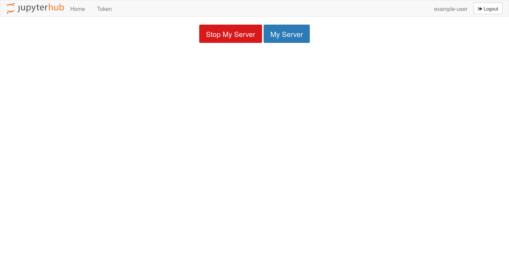
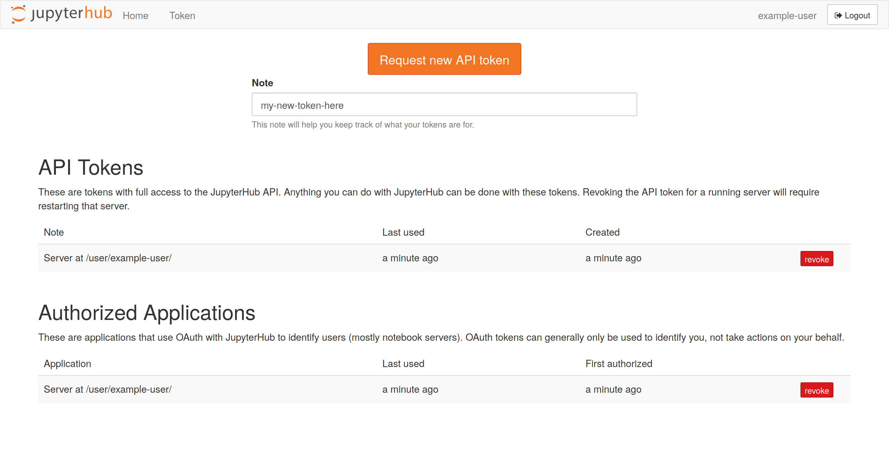

# JupyterHub Client


Automation of JupyterHub

# Install

```shell
pip install jhub-client
```

# Command Line Usage

Below are some example use cases of the tool. Note that with an admin
api token you can impersonate users and create temporary
users. Service api tokens do not have an associated user therefore
must run as existing users or temporary users.

Set the api token used for `jhub-client`.

```shell
export JUPYTERHUB_API_TOKEN=<api-token>
```

Optionally basic authentication can be used instead of token based
(not recommended but needed in some use cases). In which case
`username` and `password` are required.

```shell
export JUPYTERHUB_USERNAME=<username>
export JUPYTERHUB_PASSWORD=<password>
```

## Token

```shell
$ jhubctl token --help
usage: __main__.py token [-h] [--hub HUB] [--name NAME]

optional arguments:
  -h, --help   show this help message and exit
  --hub HUB    url for running jupyterhub cluster
  --name NAME  name to give to jupyterhub api token
```

A simple command line utility can be used to create a token. This only
supports basic authentication (`username` and `password`) login to the
jupyterhub cluster.

## Run

```shell
$ jhubctl run --help
usage: __main__.py run [-h] -n NOTEBOOK [--auth-type {token,basic}] [--hub HUB] [-u USERNAME]
                       [--user-options USER_OPTIONS] [--temporary-user] [-d] [--stop-server] [--validate]
                       [--kernel-spec KERNEL_SPEC] [--output-filename OUTPUT_FILENAME]

optional arguments:
  -h, --help            show this help message and exit
  -n NOTEBOOK, --notebook NOTEBOOK
                        notebook to run
  --auth-type {token,basic}
                        jupyterhub authentication type to use with default of token based
  --hub HUB             url for running jupyterhub cluster with default of 'http://localhost:8000'
  -u USERNAME, --username USERNAME
                        username to run notebook as
  --user-options USER_OPTIONS
                        json object representing user server options
  --temporary-user      create user temporarily if does not exist
  -d, --daemonize       run notebook asyncronously
  --stop-server         stop server after completion of notebook
  --validate            validate notebook output matches
  --kernel-spec KERNEL_SPEC
                        kernel spec to launch is not specified will use default
  --kernel-execution-timeout 60
                        the time limit (default 1min) to run each cell
  --output-filename OUTPUT_FILENAME
                        output filename for results of running notebook
```

### Run notebook as given token user syncronously

You can run a given notebook as a pre-existing user syncronously. The
api token either has to be for the given user or an admin token.

```shell
jhubctl --verbose run --notebook <notebook> --hub <hub_url>
```

### Run notebook as given token user syncronously and validate notebook output matches

You can run a given notebook as a pre-existing user syncronously. The
api token either has to be for the given user or an admin token.

```shell
jhubctl run --notebook <notebook> --hub <hub_url> --validate
```

### Run notebook as given token user asyncronously and shutdown server after completion

You can run a given notebook as a pre-existing user asyncronously and
stop server after completion. The api token either has to be for the
given user or an admin token.

```shell
jhubctl run --notebook <notebook> --hub <hub_url> --daemonize --stop-server
```

### Run notebook as given token user with user options

While this is an advanced use case, it is often times encountered
with kubernetes jupyerhub clusters where you may want to select a
given profile e.g. small, medium, gpu jupyterlab session. For these
clusters you must supply `--user-options='{"profile": 0}'` where 0 is
replaced with the index of the profile you would like to choose. It is
possible for other more customized jupyterhub clusters that different
options must be used.

```shell
jhubctl run --notebook <notebook> --hub <hub_url> --user-options='{"profile": 1}'
```

### Run notebook as given token user with user options

You can run a given notebook with any available kernel spec.

```shell
jhubctl run --notebook <notebook> --hub <hub_url> --kernel-spec=python3
```

### Run a given notebook as a temporary user

Additionally you can temporarily create a user `user-<uuid>` or supply
the temporary user's username. The username will be deleted upon
completion. The api token requires admin permissions.

```shell
jhubctl run --temporary-user --notebook <notebook> --hub <hub_url> [--username <username>]
```

# Testing

Bring up test jupyterhub cluster

```shell
cd tests/assets
docker-compose up --build
```

Run unit tests

```shell
pytest
```

# FAQ

## Creating an API Token

Login to the given jupyterhub cluster


Access the hub control page. The url will be `<hub_url>/hub/home`.



Click on `Token` in top left corner and request new api token. This
token will have the permissions of the user. Make sure to set the
environment variable `JUPYTERHUB_API_TOKEN` to the value of the given
token.



If you want to add a service token instead edit the jupyterhub
configuration.

```python
c.JupyterHub.services = [
 {
        'name': '<my-service-name>',
        'api_token': '<my-super-secret-long-token>',
        'oauth_no_confirm': True,
        'admin': True
    }
]
```

# Code of Conduct

To guarantee a welcoming and friendly community, we require contributors to follow our [Code of Conduct](https://github.com/Quansight/.github/blob/master/CODE_OF_CONDUCT.md).

# License

[jhub-client](https://github.com/Quansight/jhub-client/blob/main/LICENSE)
is BSD-3 Licensed
