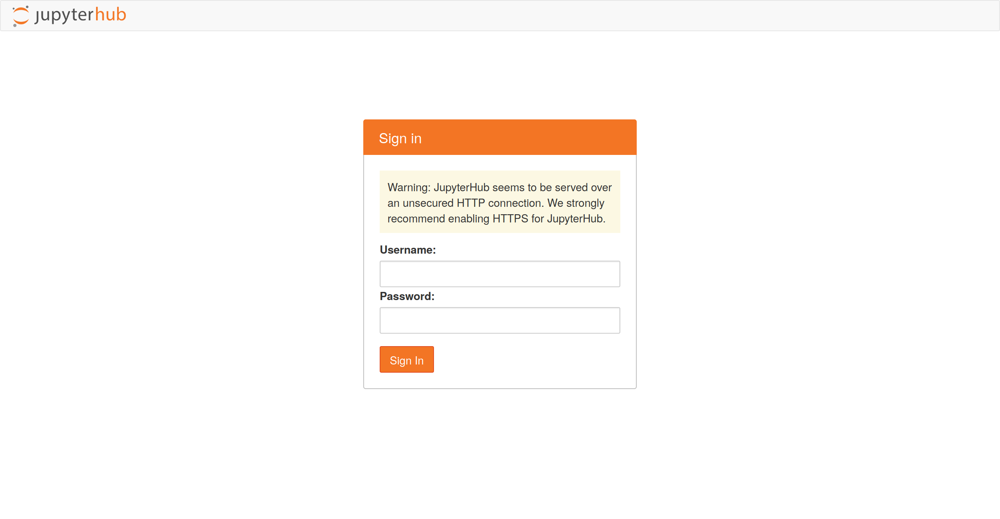

# JupyterHub Client

Automation of JupyterHub

# Command Line Usage

Bellow are some example use cases of the tool

## Run notebook as given user syncronously

You can run a given notebook as a pre-existing user syncronously. The
api token either has to be for the given user or an admin token.

```shell
export JUPYTERHUB_API_TOKEN=<api-token>
jhubctl --verbose run --username <username> --notebook <notebook> --hub <hub_url>
```

## Run notebook as given user syncronously and validate notebook output matches

You can run a given notebook as a pre-existing user syncronously. The
api token either has to be for the given user or an admin token.

```shell
export JUPYTERHUB_API_TOKEN=<api-token>
jhubctl run --username <username> --notebook <notebook> --hub <hub_url> --validate
```

## Run notebook asyncronously and shutdown server after completion

You can run a given notebook as a pre-existing user asyncronously and
stop server after completion. The api token either has to be for the
given user or an admin token.

```shell
export JUPYTERHUB_API_TOKEN=<api-token>
jhubctl run --username <username> --notebook <notebook> --hub <hub_url> --daemonize --stop-server
```

## Run a given notebook as a temporary user

Additionally you can temporarily create a user `user-<uuid>` or supply
the temporary user's username. The username will be deleted upon
completion. The api token requires admin permissions.

```shell
export JUPYTERHUB_API_TOKEN=<api-token>
jhubctl run --temporary-user --notebook <notebook> --hub <hub_url> [--username <username>]
```

# Testing

Bring up test jupyterhub cluster

```shell
cd tests/assets
docker-compose up --build
```

Run unit tests

```shell
pytest
```

# FAQ

## Creating an API Token

Login to the given jupyterhub cluster



Access the hub control page. The url will be `<hub_url>/hub/home`.


Click on `Token` in top left corner and request new api token. This
token will have the permissions of the user. Make sure to set the
environment variable `JUPYTERLAB_API_TOKEN` to the value of the given
token.


If you want to add a service token instead edit the jupyterhub
configuration.

```python
c.JupyterHub.services = [
 {
        'name': '<my-service-name>',
        'api_token': '<my-super-secret-long-token>',
        'oauth_no_confirm': True,
        'admin': True
    }
]
```
